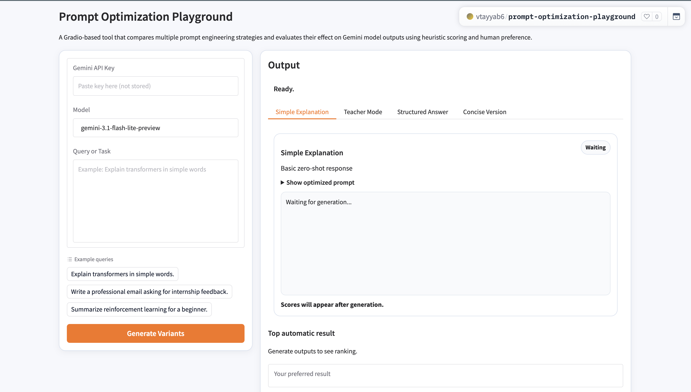
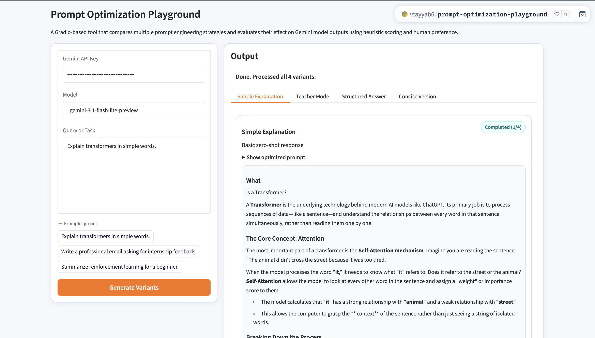

# Prompt Optimization Playground

Live Demo: [https://vtayyab6-prompt-optimization-playground.hf.space](https://vtayyab6-prompt-optimization-playground.hf.space)

A Gradio app for comparing prompt-engineering variants on the same query, scoring outputs automatically, and selecting a preferred response.

## Key Features

| Feature | Details |
| --- | --- |
| Two-stage flow | Each variant first generates an optimized prompt, then generates a final answer from it. |
| Side-by-side comparison | Four tabbed variants: Simple, Teacher, Structured, Concise. |
| Heuristic scoring | Relevance, Length, Readability, Structure, and Overall score. |
| Human preference | Manual “preferred result” selector for subjective comparison. |
| Streaming updates | Results appear progressively as variants finish. |
| Safe key handling | API key is entered in the UI and not stored. |

## How It Works

1. Enter Gemini API key and query.
2. The app creates four strategy-specific optimization prompts.
3. Gemini returns one optimized prompt per strategy.
4. Gemini generates one final answer per optimized prompt.
5. The app scores responses and surfaces the top result.

## Use Cases

| Use Case | Why It Helps |
| --- | --- |
| Prompt strategy evaluation | Quickly see which strategy performs best for your task style. |
| Writing quality review | Compare clarity, structure, and readability across variants. |
| Education and demos | Show how prompt design changes output quality in real time. |
| Workflow prototyping | Pick the best prompt pattern before integrating into a product. |

## Screenshots

### Before Generation



### After Generation



## Local Setup

```bash
python3 -m venv .venv
source .venv/bin/activate
pip install -r requirements.txt
python app.py
```

## Project Structure

```text
prompt-variant-lab/
├── app.py
├── requirements.txt
├── README.md
├── assets/
│   └── screenshots/
│       ├── before-generation.png
│       └── after-generation.png
└── src/
    ├── config.py
    ├── prompt_templates.py
    ├── generator.py
    └── scorer.py
```
